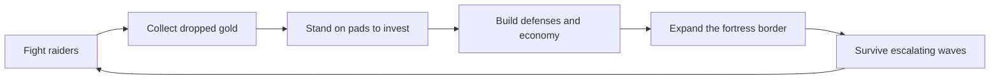

# Emberhold

## Product Direction

Emberhold is a compact, endlessly scaling action-defense game inspired by the satisfying
loop shown in mobile strategy ads: run around as a hero, shoot approaching raiders, collect
their coins, and physically deliver those coins to build pads inside a growing fortress.
The player's base becomes a visible record of their progress.

The prototype is intentionally original in theme and presentation. It uses a warm frontier
fort palette, clean readable shapes, and a lightweight browser canvas engine.

## Player Experience

The first minute should teach the game without a modal:

1. The hero starts near the keep and automatically fires at the closest raider.
2. Defeated raiders drop coins. Walking close to them collects them.
3. A pulsing build pad near the keep asks for coins. Standing on it invests carried gold.
4. The completed archer tower starts firing automatically.
5. The player discovers a mine pad, bow training, support towers, and border expansions.
6. Each expansion reveals stronger build choices and makes the fortress visibly larger.

The intended feeling is a repeating alternation between pressure and payoff: leave safety
to collect, return to invest, then watch the fortress do more of the work.

## Core Loop

## Systems

### Combat

- The hero moves with WASD, arrow keys, or click/tap destinations and auto-fires at nearby
  enemies.
- Shift triggers a short cooldown dash for riskier collection runs beyond the walls.
- Space or the tappable HUD control triggers a cooldown-based volley ability.
- Raider kills award hero experience for incremental late-game scaling.
- Every fifth-wave elite drops an Ember Sigil that briefly accelerates auto-fire.
- Towers acquire targets independently.
- Raiders, runners, brutes, and every fifth-wave elite funnel through fortress gates toward
  the keep.
- Defeated enemies leave collectible gold drops.
- Gold drops within the deployed hero's shooting range drift toward the hero, and the camera
  follows collection runs beyond the walls so ranged kills do not strand rewards outside the
  playable frontier.
- A compact edge beacon counts off-camera gold so the larger frontier remains navigable
  without filling the screen with markers.
- A matching keep beacon points home when a collection run carries the camera far beyond
  the walls.

### Build Pads

Build pads use a common definition shape: position, cost, unlock stage, type, label, short
map label, and optional dependency. Standing on an available pad for half a second begins
depositing carried gold over time. The dwell grace prevents accidental drive-by spending.
The common data shape makes new buildables cheap to add while preserving a consistent
interaction.

### Walls And Barricades

- Outer fort walls and active barricades are solid for both heroes and raiders.
- Four stage-one cardinal barricade pads build destructible inner gate blockers.
- Raiders attack the matching barricade before advancing to the keep.
- Destroyed barricades reopen their pad with a fresh build cost, making repairs a movement
  and economy decision during pressure.

### Economy And Progression

- Mines create periodic gold drops inside the walls.
- The Repair Yard restores a capped amount of keep integrity after each held wave.
- Bow training increases hero damage and fire rate.
- Banner towers buff nearby defense towers.
- Cannons deal splash damage, the armory improves all towers, and the Ember Shrine improves
  the hero's volley.
- Dependency-aware level-II pads improve specific completed towers without adding another
  structure to the map.
- The stage-four Warden Lodge unlocks Mira, a slower but harder-hitting alternate hero.
  Players can swap heroes from the portrait control or with `H`.
- Border gates expand the fort footprint and reveal additional pads.
- The deadzone camera keeps the early fort stable and follows the hero on longer frontier
  runs.
- Enemy health, speed, damage, and wave composition climb forever.
- Every third cleared wave offers a paused boon draft: hero damage, keep integrity, or tower
  power. This adds run-to-run decisions without interrupting the core movement loop.

## Architecture

The shipped game deliberately avoids runtime dependencies:

- `index.html` owns semantic HUD markup and the canvas shell.
- `styles.css` owns presentation and responsive layout.
- `src/core.js` contains pure reusable math and progression helpers covered by tests.
- `src/config.js` contains build-pad tuning and visual palette definitions.
- `src/game.js` contains simulation state, entity updates, rendering, and input.
- `tests/core.test.js` verifies the pure progression and geometry helpers.
- `tests/config.test.js` checks build dependencies, staged unlocks, and hero tradeoffs.
- `scripts/browser-smoke.mjs` uses the development-only `ws` package to exercise a real
  headless Edge session through its debugging protocol.

The runtime is a fixed-step-ish animation loop with delta-time clamping. Entities are plain
objects stored in arrays, which is a good fit for the prototype's expected counts and keeps
iteration direct. Rendering is layered in a single canvas pass: world, build pads, entities,
effects, then world labels.

## Iteration Roadmap

1. Completed: hero combat, pickups, pad deposits, towers, mines, and four fortress stages.
2. Completed: support banners, cannons, tower upgrades, armory scaling, and repair yard.
3. Completed: raiders, runners, brutes, elite waves, Ember Sigils, XP, and alternate heroes.
4. Completed: onboarding cues, click/tap controls, camera tracking, particles, synthesized
   audio, responsive layout, persistence, and browser-driven smoke coverage.
5. Future candidates: multiple biomes, richer meta-progression, authored sound effects, and
   a third hero profile.

## Decision Log

- Chose HTML canvas over a component-heavy framework because the prototype is simulation
  driven, the workspace started empty, and rapid mechanical iteration matters most.
- Chose physical coin pickups and pad deposits instead of instant spending to make movement
  inside and outside the walls meaningful.
- Chose data-driven pads so expansions can reveal new capabilities without special-case UI.
- Chose original names, visual language, and tuning so the result is inspired by the ad loop
  rather than a direct copy of Kingshot assets or identity.
- Routed enemies through cardinal gates after visual QA showed straight-line pathing could
  strand raiders against decorative walls.
- Added stepped circle-versus-rectangle collision sweeps for heroes, dashes, and raiders so
  neither ordinary movement nor burst movement can tunnel through walls.
- Added frame-rate-independent pad deposit accumulation after automated browser testing
  exposed overly fast per-frame minimum deposits.
- Added smooth deadzone camera tracking so the early fort stays visually stable while
  frontier collection runs and stage-four roaming remain playable.
- Added a development-only headless browser smoke run for build deposits, expansion, camera
  tracking, combat pressure, wave rewards, defeat, persistence, and restart behavior.
- Added a distinct Warden hero profile as a late-game unlock so scaling includes a meaningful
  play-style choice, not only numeric upgrades.
- Added a three-way boon draft every third cleared wave to create run variation while keeping
  choices short enough that they do not smother the arcade pacing.
- Turned the Repair Yard into a capped between-wave keep repair so its value remains visible
  after the initial purchase.
- Expanded the roaming frontier and added gentle coin attraction after hands-on playtesting
  showed that ranged kills could leave rewards awkwardly out of reach.
- Added a cooldown dash with keyboard and touch controls, plus paired loot and keep edge
  beacons, so longer collection runs stay quick and readable on desktop and mobile.
- Added solid wall collision, rebuildable cardinal barricades, shooting-range coin
  attraction, and pad dwell grace after another hands-on playtest pass.
